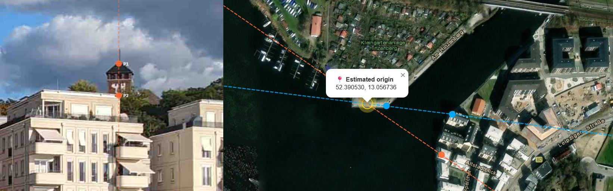

<h1> TracePoint</h1>

**Locate the origin point of a photograph using geometric ray intersection.**

`TracePoint` is a browser-based geolocation tool built for OSINT investigators, journalists, and researchers who already know how to geolocate images, and want a dedicated instrument to do it faster and more precisely. No uploads. No server. Everything runs locally in your browser.

**[Try it live → kluter.github.io/TracePoint](https://kluter.github.io/TracePoint/)**



---

## The Method

Draw a vertical line across a photograph and it passes through objects at different depths - foreground, midground, horizon. Each of those objects can be found on a map, and together they define a geographic bearing: a **ray**.

Repeat for a second line and you get a second ray. **Where the rays cross is where the photographer was standing.**

The more lines you add, the more rays are generated and the more robustly the intersection is averaged. This is a photographic application of the surveying technique known as **Resection by Intersection** — the same principle used to triangulate a position from known landmarks. `TracePoint` turns that manual, tab-switching workflow into a single focused tool.

---

## Features

- Split-panel interface: Photo left, satellite map right
- Drop any image to load it; scroll to zoom, space+drag or middle-click to pan
- Horizon correction: Draw a reference line on the image to level a tilted photo before analysis
- Vertical alignment lines: Add as many as needed, drag to position
- Point markers on each line, linked to map coordinates with one click
- Automatic ray casting once two geo points are placed on a line
- Intersection marker with lat/lon readout, averaged across all ray pairs
- Map layer switcher: Esri Satellite, OpenStreetMap, OSM Humanitarian, Esri Topo, Esri Streets
- Fully client-side: No server, no uploads, no tracking

---

## How to Use

> **Level the image (optional):** If the photo is tilted, click **Level** first and draw a line along something that should be horizontal — a roofline, a wall top, a horizon. The image rotates to compensate. Click **Level** again to reset.
 
1. **Load a photo:** Drop an image onto the left panel.
2. **Add a line:** Click **+ New Line** and drag it over a recognisable object you can also find on the map: a building corner, tower, road junction.
3. **Mark points:** Switch to **Add Point** mode and click on the line at the position of each reference object. You need at least two points per line.
4. **Place points on the map:** Click the map pill next to each point, then click its location on the map. The tool advances automatically.
5. **Read the result:** Once two lines each have two geo points, rays appear and the intersection is calculated. The pulsing yellow marker shows the estimated origin.
> **Tips:** Use objects spread across different depths for a more accurate bearing. Three or more lines significantly improve accuracy when the first two rays are nearly parallel. Press **ESC** to deselect or cancel at any time.


---

## Controls

| Action | How |
|---|---|
| Zoom image | Scroll wheel |
| Pan image | Space + drag, or middle-click drag |
| Level image | Level button, then click two points on a horizontal reference |
| Reset level | Click Level button again when correction is active |
| Add a line | + New Line button |
| Drag a line | Click and drag the line |
| Deselect / cancel | Click blank canvas, or ESC |
| Add a point | Add Point mode, click on the line |
| Place point on map | Click the map pill, then click the map |
| Delete a line or point | × button in the toolbar |
| Switch map layer | ☰ button, top-right of map |

---

## Technical Notes

Rays are computed from the bearing between two geo-referenced points. Intersection uses flat-plane geometry on lat/lon coordinates — accurate to within a few metres for scenes under ~10 km, which covers virtually all real-world photography. Each ray extends 50 km in both directions, long enough to contain any realistic intersection while keeping the map readable.

No data leaves your machine. Map imagery is served by public tile servers (Esri, OpenStreetMap). The only dependency is [Leaflet](https://leafletjs.com/), everything else is vanilla HTML, CSS, and JavaScript.

---

## Running Locally

```bash
npx serve .
# or
python3 -m http.server
```

Sample images (`Potsdam_Germany.jpg`, `Wuerzburg_Germany.jpg`) are in `assets/` if you want to test without a photo of your own.

---

## License

See `LICENSE`.